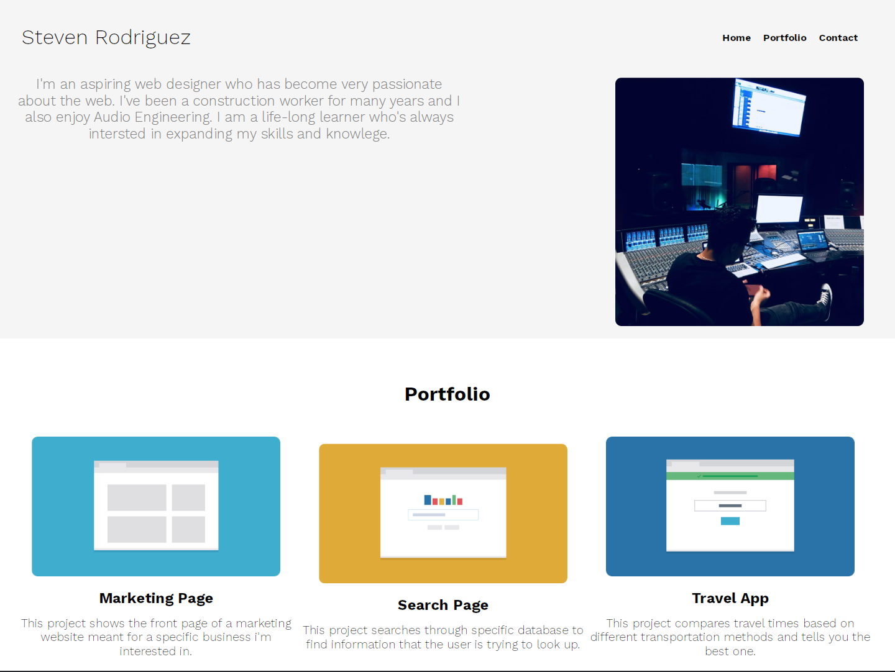

# <Personal Portfolio>

## Description
This is My personal Portfolio to display my recent projects.
- What was your motivation:To host all my projects in one place

## Table of Contents (Optional)
- [Installation](#installation)
- [Usage](#usage)

## Installation
no installation necessary

## Usage

Provide instructions and examples for use. Include screenshots as needed.

To add a screenshot, create an `assets/images` folder in your repository and upload your screenshot to it. Then, using the relative filepath, add it to your README using the following syntax:

    ```md
    

